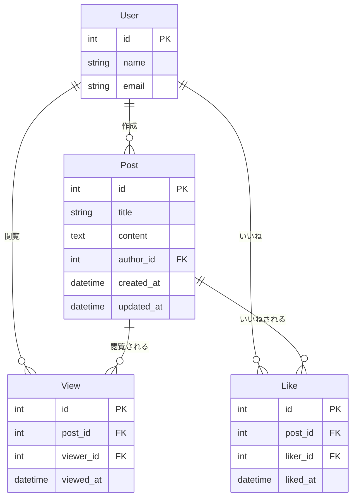
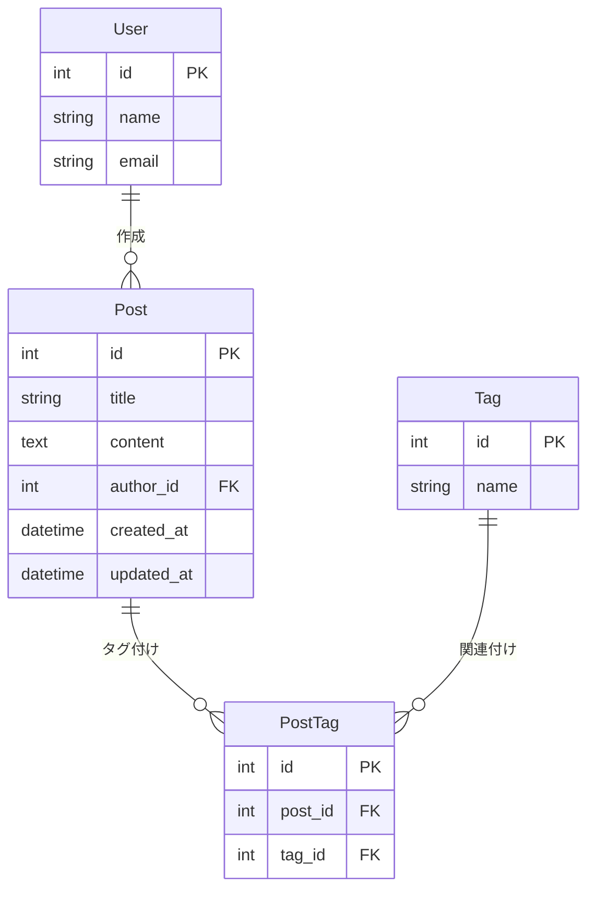

:::message
これは [LAPRAS Advent Calendar 2024](https://qiita.com/advent-calendar/2024/lapras) 18 日目の投稿です。
:::

ORM は現代の Web 開発ではなくてはならないツールです。ORM によってデータベースの操作が簡潔に書けるようになり、コードをメンテしやすくなり、SQL インジェクションを防ぐことができます。
他方で DB 操作が抽象化されているがゆえに、予期せぬクエリが発行されて問題を引き起こすことがあります。

LAPRAS では Django を使ってバックエンドを開発しています。
このエントリでは、私が約 3 年にわたって Django ORM のコードを書いてきた中で実際に見た (そして、自分もやらかした) パターンを中心に、そこから学んだことをまとめていきます。

# Summary

- 複数の関連テーブルを `annotate()` でナイーブにカウントすると、巨大な一時テーブルが生成されて DB のメモリを食い尽くすことがある。サブクエリを使おう。
- `filter()` で関連テーブルの値を使って複数検索すると結果が重複することがある。`Exists()` を使おう。

## 基礎的な内容については触れません

N + 1 などの有名なパターンはすでに語りつくされているので、他に譲ります。
https://dev.to/pragativerma18/how-to-handle-n1-queries-for-optimal-database-performance-in-django-37ko

> Django における N+1 問題は`select_related()`や`prefetch_related()`等を活用して関連データを効率的に取得することで解決でき、これによりパフォーマンスを最適化できるという内容

以前 [みんなの Python 勉強会#87](https://startpython.connpass.com/event/263565/) でより基礎的な内容を話したので、よろしければこちらもご覧ください。

https://speakerdeck.com/takeaship/django-orm-pahuomansutips

# 1. 複数の関連テーブルを `annotate()` でナイーブにカウントする

A 君はブログサービスを運営しています
ユーザーは投稿(Post) を作成でき、他のユーザーはその投稿を閲覧したりいいねしたりできます。
これらの機能は次のテーブルで実現されています。

- Post: 投稿
- View: 投稿への閲覧履歴
- Like: 投稿へのいいね

ER 図を示します。



あるとき、A 君は週間人気記事ランキングをユーザーに公開する新機能を開発することになりました。
次のクエリで重み付けした View 数と Like 数の合計が大きい順に Post を 30 件取得します。
ローカル環境ではうまく動いているようです。ステージング環境のテストも通過したので、本番にリリースしました。

```python
from django.db.models import Count, F, Q, Value

Post.objects.annotate(
    view_count=Count(
        "view",
        filter=Q(
            view__viewed_at__gte=start_of_week,
            view__viewed_at__lte=end_of_week,
        ),
        distinct=True,
    ),
    like_count=Count(
        "like",
        filter=Q(
            like__liked_at__gte=start_of_week,
            like__liked_at__lte=end_of_week,
        ),
        distinct=True,
    ),
).annotate(
    popularity=F("view_count") + Value(50) * F("like_count"), # いいねは50倍の重み付け
).order_by("-popularity")[:page_size]

```

リリース後、本番でランキング画面を開くと、**なんとブログサービス全体が停止し、ユーザーがサービスを利用できなくなってしまいました。**
一体何が起きたのでしょうか。

## 複数のテーブルが順に JOIN されて中間テーブルの行数が爆発し、DB のメモリを食い尽くす

### Summary

- 複数のテーブルを使って `annotate()` するとそれぞれのテーブルの行数を掛け合わせた行数の中間テーブルが生成される
- 本番環境ではデータ量が多いため、中間テーブルの行数が爆発的に増加した
- その結果、DB のメモリを食い尽くしてサービスが停止した

A 君が書いたコードでは`annotate()` に `distinct=True` オプションをつけていることに注目してください。これをつけないと`Count()` の結果がおかしくなります。
`view_count`, `like_count` はそれぞれ今週の閲覧数, いいね数であるべきですが、`distinct=True` をつけないと両方にそれぞれをかけ合わせた値が入ります。
例えば閲覧数 1,000、いいね数 10 の投稿の場合は`view_count`, `like_count` の値が共に 10,000 になります。

https://stackoverflow.com/questions/6795202/django-count-in-multiple-annotations

> Django で複数の`Count()`を使用して`annotate()`すると重複が発生し期待と異なる結果が生成されるため、正しい結果を得るには`Count('field', distinct=True)`を使用して重複を排除する必要があるという内容

そこで `distinct=True` を使うと正しくカウントできますが、これによって重大な問題が隠れてしまいます。
裏では 10,000 行が DB のメモリ上に展開されており、`distinct=True`オプションはこれをカウントするときに重複を除いているだけなのです。

**ローカル、ステージング環境ではデータ量が少なく問題になりませんでしたが、本番環境では Post も View も Like も 1,000 行以上存在します。**
それぞれが掛け算で行数が膨れ上がった結果、DB のメモリを食い尽くしてインスタンスが停止してしまいました。

## 解決法: サブクエリを使う

`Subquery()` を使い View, Like を予め絞り込んでおくことで巨大な一時テーブルを発生させることなくランキングが取得できます。

```py
from django.db.models import Count, OuterRef, Subquery

view_count_subquery = View.objects.filter(
    post_id=OuterRef("post_id"),
    viewed_at__gte=start_of_week,
).values("post_id").annotate(
    count=Count("id"),
).values("count")

like_count_subquery = Like.objects.filter(
    post_id=OuterRef("post_id"),
    liked_at__gte=start_of_week,
).values("post_id").annotate(
    count=Count("id"),
).values("count")

Post.objects.annotate(
    view_count=Subquery(view_count_subquery),
    like_count=Subquery(like_count_subquery),
).annotate(
    popularity=F("view_count") + Value(50) * F("like_count"),
).order_by("-popularity")[:page_size]
```

ただし、この方法でも Post の行数が大きくなれば重いクエリになることは避けられません。
パフォーマンスを追求するなら

1. マテリアライズドビューなどのキャッシュ機能を使う
2. ランキングの集計テーブルをあらかじめ作っておく
3. Post に人気度の列を作り、集計値を入れておく

などを検討してください。
私は 1 が好みです。3 の方法はあまり美しくないですね。

# 2. 関連テーブルの値を使って OR 検索する

A 君はブログサービスに投稿へのタグ機能を追加することになりました。
ユーザーが投稿にタグ付けしたり、タグを使って投稿を検索したりできるようにしたいです。
タグと投稿は N:N の関係にあります。
そこで A 君は Tag テーブルと中間テーブルの PostTag テーブルを作成しました。

ER 図を示します。(View, Like は省略)



続いて、ユーザーが関心のあるタグ(複数選択可能)のいずれかを含む投稿をリストアップするために次のクエリを書きました。

```py
interested_tag_ids=[1, 2, 3] # ユーザーが関心のあるタグIDのリスト
Post.objects.filter(
    posttag__tag_id__in=interested_tag_ids,
).all()[:page_size]
```

すると複数タグを指定したときに、同じ投稿が繰り返し表示されてしまうバグが発生してしまいました。

## 関連テーブルの値で絞り込むとき、指定した条件を複数満たす行は複数回 SELECT される

### Summary

- 1:N や N:N の関係にある関連テーブルの値を使って`filter()`すると裏で関連テーブルが JOIN され、条件を満たした数だけ行が複製される

このバグは常に発生するわけではなく、次の条件で発生します。

- 複数のタグを検索条件に指定する
- 指定したタグを 2 つ以上含む投稿が存在する

条件に指定したタグを N 個含む投稿は、N 回表示されることになります。
なぜこのような重複が起きるかは、ORM が発行する SQL を見れば一目瞭然です。

```sql
SELECT * FROM post
INNER JOIN post_tag ON post.id = post_tag.post_id
WHERE post_tag.tag_id IN (1, 2, 3)
```

同じ`post`に対し条件を満たす`post_tag`が複数ある場合は、その数だけ`post`が複製されることになります。
Python や JavaScript 標準の`filter()`関数を使ってリストを絞り込んだときはこのような重複は起こらないですが、同じ感覚で ORM のクエリを書くとこのような失敗をしてしまいます。

## 解決法: EXISTS句 を使う

次のように書き換えることで、重複を防ぐことができます。

```py
Post.objects.filter(
    Exists(PostTag.objects.filter(
        post_id=OuterRef("pk"),
        tag_id__in=interested_tags,
    )),
).all()[:page_size]
```

このクエリは次のような SQL を発行します。

```sql
SELECT *
FROM post
WHERE EXISTS (
    SELECT 1
    FROM posttag
    WHERE posttag.post_id = post.id
      AND posttag.tag_id IN (<interested_tags>)
)
LIMIT <page_size>;
```

JOIN せずに WHERE EXISTS で条件を満たす行を絞り込んでいるため、条件を複数満たしていても行が複製されません。

# おわりに

これらの失敗は Django ORM の初心者ではなく、むしろ普段からコードを書いていて慣れている人がやってしまうものです。
N+1 を起こさないようにしよう、できるだけ少ない問い合わせ回数でデータを取得しようと意識してコードを書いたその先にこのような罠が待ち構えています。

ORM は Python 等をパラダイムの全く異なる SQL に変換するもので、Python 等を書くときと同じ脳で書いていると足をすくわれます。
複雑なクエリを書くときはどのような SQL に変換されるかを常に意識し、ローカル環境でのテスト時に実際に発行されている SQL を確認してみるといいでしょう。
